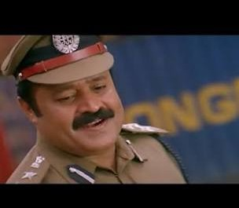

<p align="center">
  
</p>

<h1 align="center">Ormayundo</h1>

<p align="center">
  <em>Persistent long-term memory for AI agents, backed by a self-hosted knowledge graph.</em>
</p>

---

## What is this?

**Ormayundo** (Malayalam: *"Do you remember?"*) gives your AI agents memory that
survives across sessions. Instead of stuffing everything back into the context
window on every run, agents write to and read from a **self-hosted knowledge
graph** — so what an agent learned yesterday is still there today.

Under the hood it turns raw text, documents, and conversations into a structured
graph of entities and relationships, then serves that graph back to agents as
retrievable long-term memory.

## Why a knowledge graph?

Flat vector search finds *similar* chunks. A knowledge graph finds *connected*
facts — which is what multi-hop reasoning actually needs ("who did X work with
on the project that shipped in Y?"). Ormayundo builds that graph automatically
and lets agents traverse it.

The approach follows the KG + LLM interface studied in
[**Optimizing the Interface Between Knowledge Graphs and LLMs for Complex
Reasoning** (arXiv:2505.24478)](https://arxiv.org/abs/2505.24478): performance
comes not from a new architecture but from tuning the pipeline —
**chunking → graph construction → retrieval → prompting**.

## How it works

```
ingest  →  chunk  →  extract entities & relations  →  knowledge graph  →  retrieve  →  agent
```

1. **Ingest** documents, notes, or conversation transcripts.
2. **Chunk** them into tunable units.
3. **Extract** entities and relationships with an LLM.
4. **Store** them in a self-hosted graph (your infra, your data).
5. **Retrieve** connected context on demand — multi-hop, not just nearest-neighbor.

## Status

Early stage. Interfaces and layout will change.

## License

TBD.
